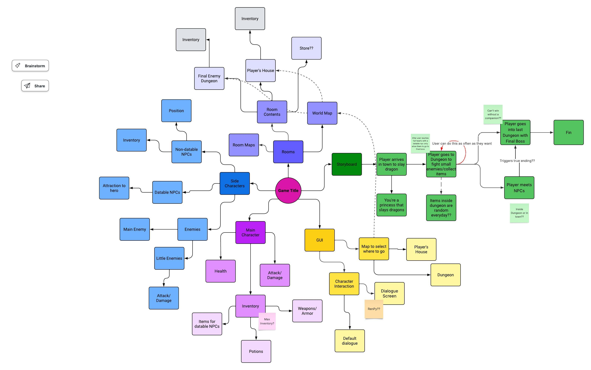

# Documentation:
> This is a summarized and better organized document based off all the notes I kept while making this project (in a physical notebook, my laptop and phone notes app, random post it's and texts to my family and loved ones).
> The original collection of thoughts, sketches, logs and records of the challenges I faced (which were many) are too unintelligible, even I can't understand them. 

## Inital Brainstorm

### The Initial Idea: 
> Dungeons & Dating follows Princess Guenevive as she arrives in a new town where a dragon s rumored to be hiding. Dungeon crawling and mosnter fighting ensues.
> That, however is not the focus of out game. No! the main focus is to romance some people and find love.

> [!IMPORTANT]
> **I had to change the main goal to romancing the dragon only because making NPCs proved too difficult :(** 

## Roadmap
The Initial Idea, broken down into (mostly) achievable goals.

_Features I did not manage to achieve are marked in ~~strikethrough~~_
### Dungeons and Dating
- [x] Intro sequence 
    - [x] Story of Main Character
        - Press enter to continue story
    - [x] Game title 
        - Press enter to start game & go to main menu

- [x] Main Menu
    - [x] Play
        - Start game (aka go to world map)
    - [x] Exit
        - Quit game loop altogether
    - [x] How to play 
        - Instructions on how to play the game
        - Return to main menu

- [x] World Map 
    - [x] Select (by clicking) where you want to go
        - Dungeon 
        - Shop
        - House
        - [x] Dungeon Area 1
            - Run around
            - Encounter monsters (slimes)
            - ~~Fight monsters~~ Instead: Collect Slimes
            - ~~Find objects~~
            - [x] Dungeon area 2 - Dragon
                - Fight dragon (immediate game over)
                - Talk to/romance dragon (win)
        - ~~[ ] Shop~~
            - ~~Buy amour~~
            - ~~Buy weapon~~
        - ~~[ ] House~~
            - ~~Save game ??~~
            - ~~End day~~

## Development Logs
### [0] Learning Game Development on YouTube and the Pygame subreddit
Before I wrote any code for this work I spent a lot of time researching and watching tutorials. I wanted to test the feasibility of my idea. Turns out pygame is not the best for the type of game I wanted to make. Thus, some features had to be sacrificed since I thought a playable game would be better than a buggy and incomplete game.
### [1] Finding Game Assets
I am not an artist. Thus, before I stared making my game I spent more time than I care to admit finding game assets that fit the aesthetic of my game. Shout out to all the incredibly talented people who made awesome free game assets and put them on Itch.io (see References for specifics).

### [2] Making maps, writing a story and modifying assets
####    [2.1] Maps:
I learned how to use Tiled to make the maps for this game! The world map, the dungeon map and the dialogue screen were made in Tiled using tilesets from the internet (see references for specifics).

Tiled ended up being super helpful to figure out the exact position of objects on the screen.

####    [2.2] Writing a story
The game needed some context before the user could hit play, so I made some Undertale inspired Introduction Sequence to tell the player what's going on. I quickly learned that pygame doesn't like text and  that the typing effect that takes a few lines of code with normal python is almost impossible to achieve (for me). Wrapping text? Unimaginable. I also learned that people haven't made  or updated pygame libraries since 2012.   
I ended up making the text images in Procreate, which is not the best solution, but I think the end product is not the worst.

####    [2.3]
Given that all the assets for Dungeons & Dating come from different sources, sometimes the disparity in style and, more importantly, color scheme was too noticable. Thus, I went back into Procreate to change some colors and move some pixels. Hopefully the final product looks  cohesive and not too unbalanced.

Every artist to make (free) slime sprites ever thinks slimes should be green, so I had to make them purple all on my own.

### [3] The code 
I knew from the beginning that making Dungeons & Dating would require some amount of modularization. Below there's some explanations and thoughts.
####    [3.1] main.py
This is where I manage game states, it's not the most elegant solution, but it works for the scope of this project.
Game states are different functions each with their own game loop and unique assets. 
It made it really easy to test the game during development and find bugs. In the end I gess my game is a bunch of very similar functions wearing a trenchcoat.
####    [3.2] global_var.py and dialogue.py
Both these helper modules exist purely to make main.py more readable since I thought having all that text in main.py would make it difficult to understand and annoying to navigate.
####    [3.3] player.py, slime.py, dragon.py and walk.py
These all help manage the different characters in the game. They deal with Sprite initializing and management to animate the characters which I think really elevates the look of the final version.
Some of them may look a little similar and that's because they probably could've been Child Classes of a Big Game Component Class. 
However, I ran into too many problems dealing with inheritance and this way they worked.
####    [3.4] button.py
Unlike the helper modules in 3.3, button mostly deals with making functional buttons out of images. The clicking of the buttons works, but I think in future versions should be separated from the "drawing" of the buttons on the screen since it limits the capabilities of the class a bit.

## Limitations and challenges
> Certain game locations that I originally wanted to include didn't make it into the final product. These areas are still kind of reachable from the World Map but the user encounters a 'not available' notice.

#### The Shop
The first challenge I faced when making the shop was designing a good-looking GUI, I learned Tiled to make the top-down maps of this game but that style didn't lend itself so well to a shop.
Furthermore, I'd only really collected pixel-art style assets for the game which wouldn't really work for shop interaction and my best attempts at drawing a shopkeeper NPC still didn't really fit the visual elements of the game.

Later on, collecting items and finding chests with coins and loot were scraped from the game so a shop wouldn't even make sense to have.

#### The House

When I set out to make this game I thought I would be able to figure out how to let the player save the game as well as manage their inventory from their house.
In the latest version of the game neither of these are possible so it made no sense to have the house at all.

> Certain features that I originally wanted to be a part of the game sadly did not make it to the latest version of the game.

#### Fighting
The main focus of Dungeons & Dating was always going to be the dating simulator of it all. I always knew the fighting in the dungeons would be really simple and, for lack of a better word, boring.
However, I never could've imagined how hard it would be to achieve even this. The sprites that started it all had no animation frames for fighting, so it looked awkward. Also, making enemies spawn and do much more than idle was too demanding and made everything lag.

Instead, the player can now collect the cute, harmless slimes in the dungeon in order to save the dragon they're in love with.

#### Collecting objects (Inventory)
You can still collect things (slimes)! It's just not as sophisticated as I originally wanted. I decided to simplify the dungeons so pygame would stop crashing.

#### Meeting and romancing NPCs
The biggest challenge that eventually made me scrap this whole aspect was pygame's inability to deal with text in a straightforward manner. 
I wanted to have classic RPG dialog  boxes  with a typing effect, which is just not easy to achieve with just pygame. Furthermore, having NPCs in the dungeons would only add more game states and longer game loops which my computer couldn't handle so the game would eventually lag a lot.

## Future Improvements
### Dungeons & Dating 2.0??
Certain things I wanted in the game obviously didn't make it to the final version. In the future, I'd love to add these features among other things.

_Features:_

- Inventory 
- Shop
- House 
- More NPCs 
- Different monsters in Dungeon
- Different endings
- Different dungeon layouts
- More dialogue

_Technical Aspects:_

- Game Component class
- Smoother movement constraints (when player walks against wall)
- Using pygame-cce might've been smarter, so next version could be converted to it?
- Typing effect
- Dialogue module that's actually scalable

### Coding Habits
I like to think that I comment code reasonably well as I go, however, this is the biggest pygame project I've embarked on so far and my dode and file organization got really messy. 
This obviously led to unnecessary bugs, errors and questioning of my decision to make a game all by myself. If I ever try to make this game properly I definitely need to be better about not copying and pasting random pieces of code somewhere or commenting out buggy code fragments that then break the whole thing. 
Also, my variable names got ridiculously long at some points where I'm not sure if it'd be understandable to others.

## References 
Other than the specific videos mentioned here, I consulted the Pygame documentation whenever I got an error.

### Tutorials 
Buttons - https://www.youtube.com/@CodingWithRuss/playlists

Game states - https://www.youtube.com/watch?v=r0ixaTQxsUI

Tiled tutorial - 

Typewriter text effect - https://www.youtube.com/watch?v=DhK5P2bWznA

Collisions - https://www.youtube.com/watch?v=BHr9jxKithk

Sprite collisions - https://www.youtube.com/watch?v=twNMiOjbI74

Fade effect for loading screen - https://www.youtube.com/watch?v=H2r2N7D56Uw

### Game Assets
Dungeon tileset - https://pixel-poem.itch.io/dungeon-assetpuck

World map tileset - https://fin-nio.itch.io/pixel-village

Slimes tileset - https://checkpointcafe.itch.io/justpixelslimes

Characters tileset - https://opengameart.org/content/tricolor-nes-rpg-character-sprite-sheets

House tileset - https://free-game-assets.itch.io/main-characters-home-free-top-down-pixel-art-asset

